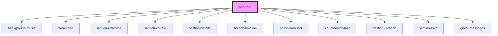

# app-root

<!-- Auto Generated Below -->

## Dependencies

### Depends on

- [background-music](../background-music)
- [floral-intro](../floral-intro)
- [section-welcome](../section-welcome)
- [section-couple](../section-couple)
- [section-details](../section-details)
- [section-timeline](../section-timeline)
- [photo-carousel](../photo-carousel)
- [countdown-timer](../countdown-timer)
- [section-location](../section-location)
- [section-rsvp](../section-rsvp)
- [guest-messages](../guest-messages)

### Graph

----------------------------------------------

*Built with [StencilJS](https://stenciljs.com/)*
